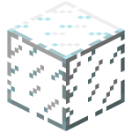

 
 

  

  <h1 align="center">That</h1>
    

    Un llenguatge de programació programable interpretat molt petit
     
    <a href="https://git.aranroig.com/BinarySandia04/that/issues">Informa d'un error</a>

  <a href="https://https://git.aranroig.com/BinarySandia04/that">Pàgina web del repositori</a>

## Coses
Això encara està en obres. Acabaré el README quan tingui temps. Com m'agrada fer amb tots els projectes que mai acabo, aqui poso una llista amb coses per fer:

## Coses per fer

Aquesta llista pot canviar en un futur

- [ ] Fer una versió estable del llenguatge
  - [ ] Poder crear variables
  - [ ] Poder assignar variables a operacions
  - [ ] Aconseguir transformar AST a bytecode
  - [ ] Acabar la màquina virtual
- [ ] Fer un README
- [ ] Fer una llibreria estandard per That
- [ ] Fer un logo
